# Task 2 - Process documentation:

## Scope:

### Assessing Potential Projects: A Three-Tiered Framework:

To effectively evaluate potential projects, the following key aspects will be considered as a framework when deciding the chosen project:

1. **Impact:** The project's ability to evoke strong emotional responses or sentimental connections.
2. **Relevance:** The project's significance in being able to measure data (environmental or sensor data).
3. **Feasibility:** The project's practicality in terms of implementation, considering factors like time, resources, and potential challenges.

For simplicity these metrics will be visualised into a graph, see the example below:

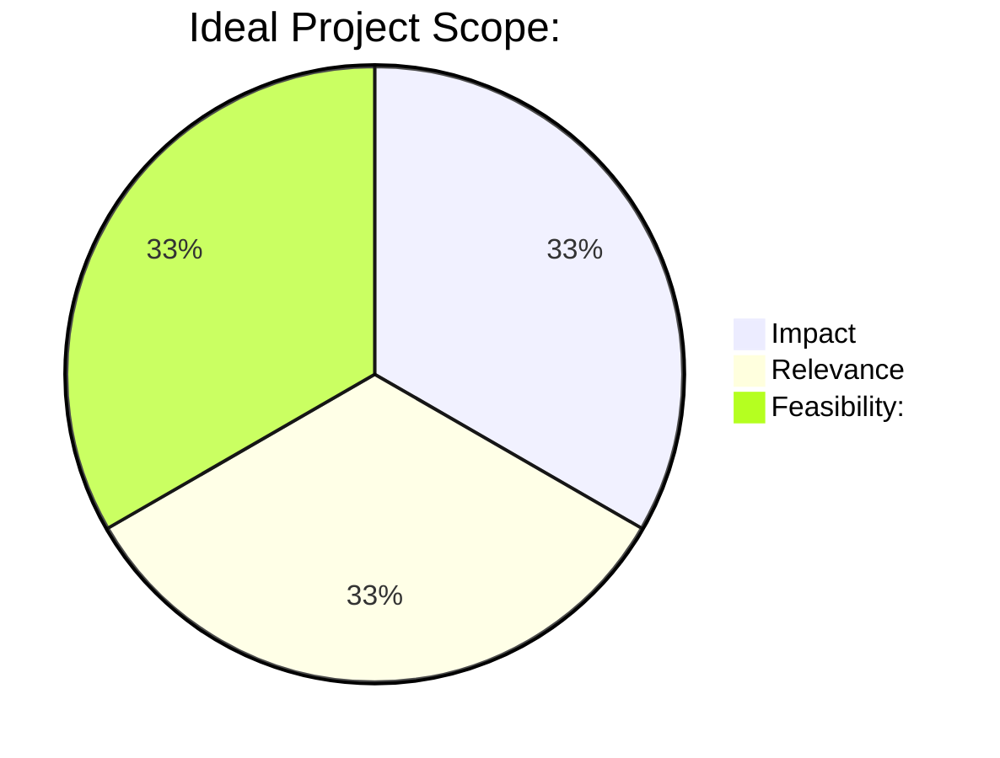
```mermaid
pie
    title Ideal Project Scope:
    "Impact" : 100
    "Relevance" : 100
    "Feasibility:" : 100 
```
## Research :

### Neopixels:
```04/09/2024```

Approaching this design task I first tried a top-down approach, I decided to investigate an interesting medium. The topic I decided to investigate was a neopixel project. Neopixels were chosen due to their potential to satisfy all aspects of the project scope. The project that was investigated was a volumetric display created by [mitxela.](https://www.youtube.com/@mitxela)


```Source:```[Mitxela's design document](https://github.com/mitxela/candle)

This project utilises an optical illusion called 'persistence of vision', a visual phenomenon where the brain retains an image for a brief period after it's no longer visible. This creates the illusion of motion when a series of still images are displayed quickly enough; similiar to a flip book animation:


```Source:```[WIKIMEDIACOMMONS](https://commons.wikimedia.org/wiki/File:Flip_Book_Movie_v2.gif)

Furthermore this illusion can be utilised to make a 2 dimensional plane appear three dimensional, when it is rotated around a fixed point. Mitxela's project implements an electric motor that spins a sheet of neopixels, resulting in the appearance of a three dimensional image:


```Source:```[Mitxela's design document](https://github.com/mitxela/candle)


Evaluating mitxela's [design documentation](https://github.com/mitxela/candle) and [github project](https://github.com/mitxela/candle) it has the potential to be an impactful medium. In its present state however it severly lacks in  depth as there is nothing meaningful; it is simply visually appealing. Not to descredit mitxela's design, it just doesn't suit the needs of this project.

Therefore, if the project were implemented it would have to further developed to convey meaning, using some form of meaningful data. Weather or temperature data from a web api or sound data from its surroundings would be appriopriote but further decrease the feasibility of the project. This would increase its impact and relevance as per the design framework.

However, this would impact upon the feasibility would make the project very difficult to complete, as mitxela's design is extremely intricate. Overall it rates in the framework as follows:

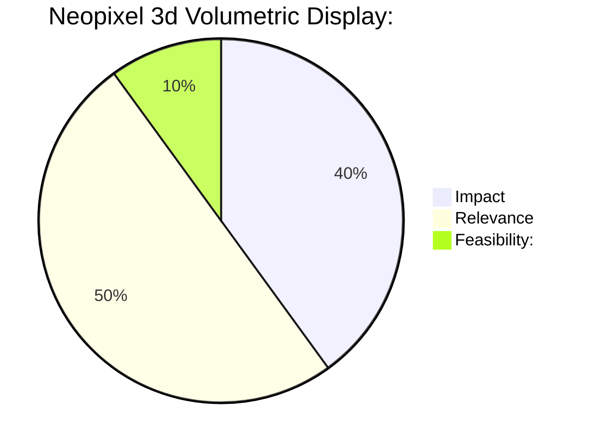
```mermaid
pie
    title Neopixel 3d Volumetric Display:
    "Impact" : 40
    "Relevance" : 50
    "Feasibility:" : 10 
```

### Python Mental Health App:
```13/09/2024```
Inspired by the complexity of my previous project, I adopted a bottom-up approach, starting with an idea and then exploring its feasibility. My longstanding interest in mental health led me to envision some form of mindfulness app as a meaningful and rewarding design challenge. I chose Python as the development language for this project.

Having recently used Python in my database design class, I found it a familiar and accessible choice for this project. Python's compatibility with most iOS devices and my existing skills in GUI development using Tkinter and Unity made it a practical option. To outline my ideas, I've arranged them from simplest to most complex implementation:
1. A mindfulness diary - an application that implements a virtual garden that you attend to by writing entries to make plants grow
2. A mindfulness engagement app - an application that utilises an [AI-Powered Meditation Generator API](https://buildship.com/blog/building-an-ai-powered-meditation-generator-api-with-buildship) to create tailored meditations for people suffering from anxiety and depression.
3. A mindfulness game - a relaxing/medatative gardening game utilising the [Unity](https://unity.com/) game engine and [Meteo Matics](https://www.meteomatics.com/en/weather-api/?ppc_keyword=weather%20api&utm_term=weather%20api&utm_campaign=Weather+API+(Australien)&utm_source=adwords&utm_medium=ppc&hsa_acc=5001518620&hsa_cam=16948893264&hsa_grp=138721398634&hsa_ad=593648296523&hsa_src=g&hsa_tgt=kwd-40383213246&hsa_kw=weather%20api&hsa_mt=e&hsa_net=adwords&hsa_ver=3&gad_source=1&gclid=Cj0KCQjwjY64BhCaARIsAIfc7YZDPhvVvZ04Wci_YFs6cRl38MSfkDfMMZPiaHskBMFPXC29pRQh5BAaApfDEALw_wcB#availabledata) web api to engage the player in real world weather data, reflected in the virtual space.

#### Further Analysis:
After evaluating my ideas, I determined that the first two projects align with my capabilities and the scope of this endeavor. However, the third concept exceeds my current comfort level, as I haven't undertaken such a large project independently. Therefore, I will concentrate on researching existing mindfulness apps to gain insights for my chosen approach

The first application I investigated was the [headspace](https://www.headspace.com/headspace-meditation-app) app, which resembles what imagine project two would look like. It is very UI heavy, which does make it less appealing, however given my ability and the nature of the idea I don't know how else I could implement it:


```Source:``` [How to use the head space app](https://youtu.be/IYTPmUDnYog)

Given the sensitive nature of mental health, I am hesitant to rely solely on AI learning models for providing support to individuals struggling with these issues. The potential for AI to misinterpret or exacerbate mental health concerns undermines the very purpose of the project. For these reasons I decided to focus on my first idea.

This left my initial idea of a mindfulness diary, which aligns with the project scope, however it lacks originality. A quick online search revealed several existing apps that offer similar functionalities. Therefore, I've decided to explore alternative concepts:

Similiar apps I found include:
- [Kinder World: Wellbeing Plants](https://apps.apple.com/us/app/kinder-world-wellbeing-plants/id1541796687)
- [Forest App](https://www.forestapp.cc/)
- [Plant Nanny](https://play.google.com/store/apps/details?id=com.fourdesire.plantnanny2&hl=en_AU)
- [Smiling Mind](https://www.smilingmind.com.au/)

This culminated in the following metrics for the idea overall:

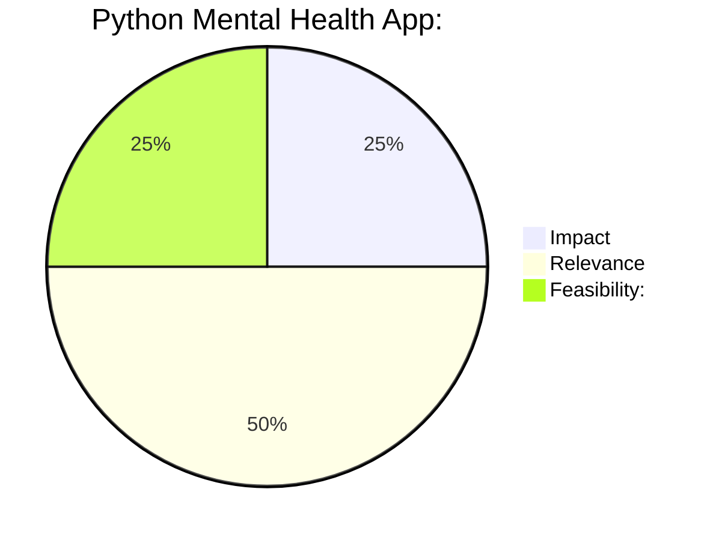
```mermaid
pie
    title Python Mental Health App:
    "Impact" : 25
    "Relevance" : 50
    "Feasibility:" : 25 
```

### Anti-vaping Art Piece:
```26/09/2024```
As I continue to brainstorm design project ideas, I'm drawn to the potential impact of addressing mental health issues. My personal struggle with nicotine addiction, which has persisted for a year, has made me acutely aware of its detrimental effects on both mental and physical well-being. To better understand how I can show the hold that vaping has on me, I've decided to research other art pieces.

I ended up finding some art competitions that occured that called on designers to provide art pieces that highlight how you can quit vaping:

```Source:```[Know the truth art challenge](https://knowthetruth.everfi.com/)


```Source:```[Deakin University Art Competition](https://blogs.deakin.edu.au/deakinlife/2024/08/19/represent-deakin-with-a-vape-free-artwork-piece-and-you-could-win-a-1500-gift-card/)

Discovering these competitions solidified my determination to create a meaningful artwork that addresses this pressing issue. It has also motivated me to openly acknowledge my struggles with quitting

Reviewing the 2023 Know the Truth competition entries, I was particularly struck by the confrontational nature of many pieces. One of my biggest challenges in quitting has been justifying my decision. The winning artwork resonated with me, featuring powerful messages about self-justification and peer pressure:

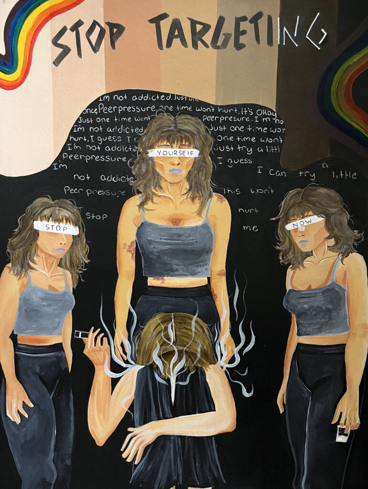
```Source:```[Know the truth art challenge winner, Kayla](https://knowthetruth.everfi.com/)

I believe I've discovered a project idea that fully meets the outlined requirements in a balanced and impactful way. The next step is to determine how I'll integrate visual design and user input into my artwork, the metrics for this design are as follows:

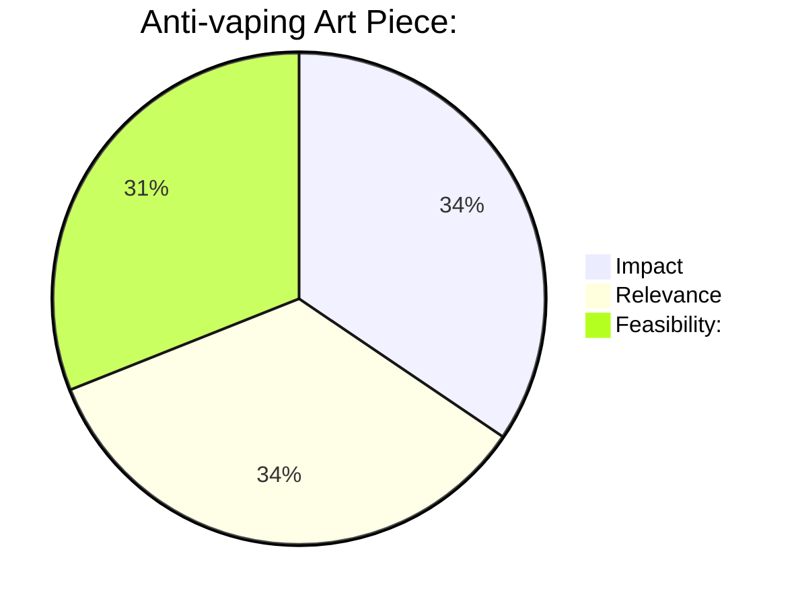
```mermaid
pie
    title Anti-vaping Art Piece:
    "Impact" : 100
    "Relevance" : 100
    "Feasibility:" : 90 
```

## Project Development:
```30/09/2024```
"While considering implementation, I've developed a metaphor that embodies the essence of my artwork: 'You Can't Fill a Bottomless Cup.' This concept, likely rooted in psychology or philosophy, perfectly encapsulates the project's central theme.

But how can I convey this message, in a way that is confronting enough that it might break the cycle of someone struggling with quitting nicotine. My first idea is to confront the viewer with a 3d print of a person laying down struggling to breathe, for now I will go off of this AI generated image from [openart.ai:](https://openart.ai/)

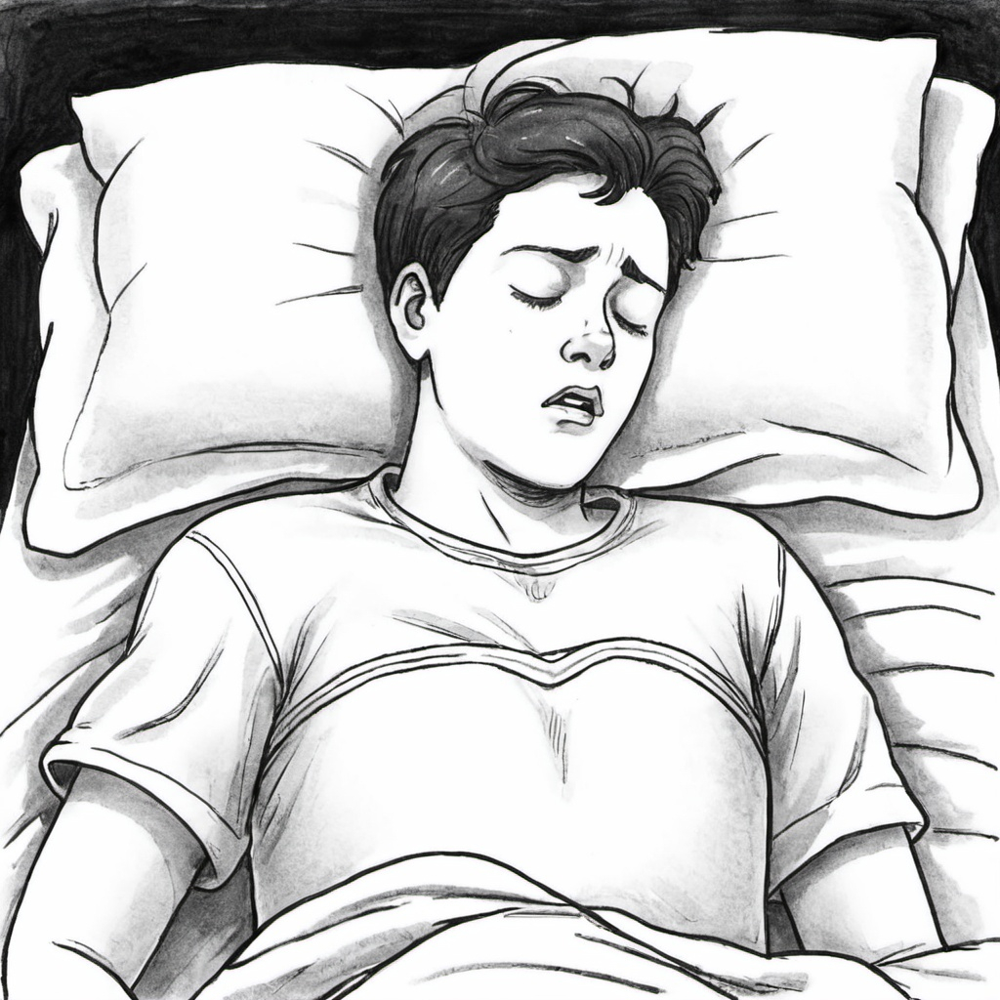
```Source:```[Openart.ai](https://openart.ai/)

 To convey the constant need for nicotine, I've conceived a scale-based measurement system. A 3D-printed or styrofoam figure will represent a person, and the presence of objects placed atop it will symbolise the overwhelming demands of addiction.

 When a vape is placed on the scale, it sends a signal to a microcontroller, silencing an alarm. However, if the scale remains empty for too long, the alarm intensifies, signifying the urgent need for nicotine. I would also like to include vibrating motor to make the figure appear as if they are shaking, this will intesify the experience.

 The following is a sketch that outlines my idea:
 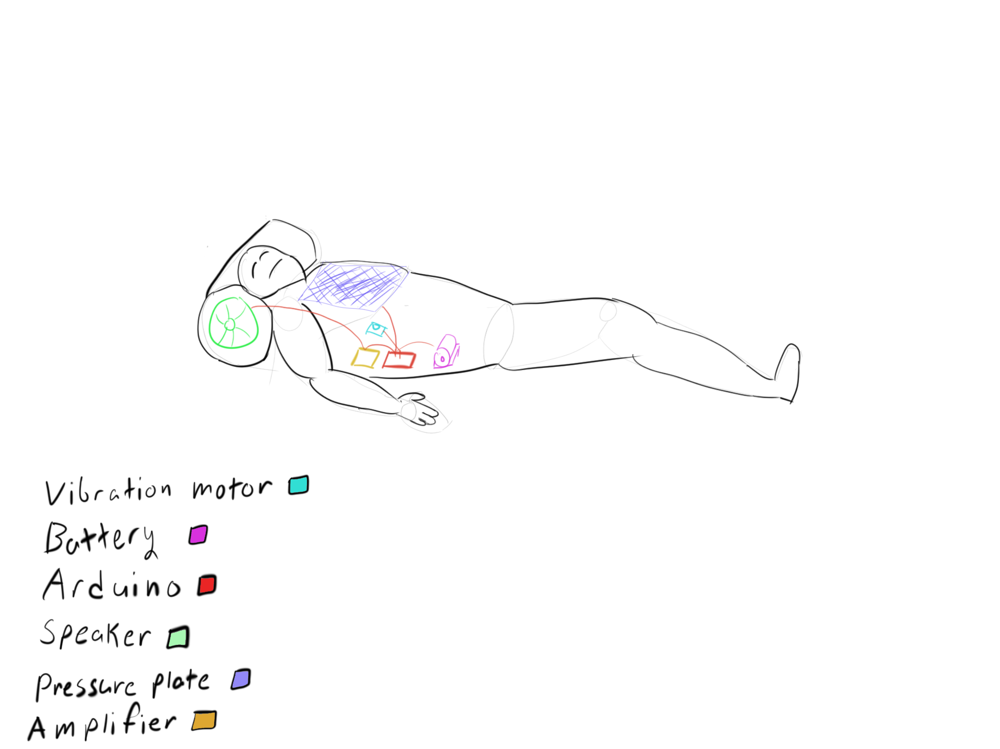

To implement this project, I've chosen Arduino due to its extensive documentation and use of C++, a language I'm eager to learn. The following components will be required:
 - Arduino Uno R4- available from Jaycar and online, found [here.](https://www.jaycar.com.au/arduino-uno-wifi-r4-development-board/p/XC9211)
 - 5V Vibrating Motor Module High and Low Motor, found online [here.](https://www.ebay.com.au/itm/186702135398?chn=ps&_ul=AU&norover=1&mkevt=1&mkrid=705-139619-5960-0&mkcid=2&mkscid=101&itemid=186702135398&targetid=2365752142950&device=c&mktype=pla&googleloc=9069073&poi=&campaignid=21766134162&mkgroupid=175112620264&rlsatarget=pla-2365752142950&abcId=10047381&merchantid=548724996&gad_source=1&gclid=Cj0KCQjwjY64BhCaARIsAIfc7YYG3_iWqa_lR8u_kZI4VlCUy5M0lEJPnqfWoHeoOwjbRl2pYflCEg8aApJrEALw_wcB)
 - Arduino Compatible Audio Amplifier with Speaker Module from Jaycar and online, found [here](https://www.jaycar.com.au/arduino-compatible-audio-amplifier-with-speaker-module/p/XC3744?srsltid=AfmBOoojRRIyjeCMKvb30vUI1rToZAg6h0-e9mk6PV5BJHd6m7xPXHN8)
 - 50KG Load Cell Weight Sensor Module, found online [here.](https://www.auselectronicsdirect.com.au/50kg-load-cell-weight-sensor-module-for-electronic?gad_source=1&gclid=Cj0KCQjwjY64BhCaARIsAIfc7YbxmDoyz-uU4ZQ2vEQBXmniLStkWcy8S3dsi9PVh2wLAc7sdZi-6KgaAqscEALw_wcB)
 - A metal plate to distrbute the load on the load cell.
 - Either styrofoam or a 3d stl file to represent the body.

## Design Documentation Moving Forward:
```02/10/2024```

1. Hardware Setup and Testing:

Assemble the hardware components, including the Arduino, motor, amplifier, load cell, and figure.
Test the individual components to ensure they are functioning correctly.
Connect the components to the Arduino and verify their communication.

2. Arduino Programming:

Write the Arduino code to control the scale, alarm, and vibrating motor.
Implement the following logic:
 1. When a vape is placed on the scale, the alarm is silenced.
 2. If the scale remains empty for a predetermined time, the alarm intensifies.
 3. The vibrating motor activates to simulate withdrawal symptoms.
 4. Consider using libraries like tone() for sound generation and Servo for controlling the vibrating motor.

 4. Integration and Testing:

Combine the hardware and software components to create a fully functional prototype. Thoroughly test the system to ensure it operates as intended and meets the project goals. Make necessary adjustments to the code or hardware if issues arise.

5. Refinement and Presentation:

Refine the design and aesthetics of the art piece to enhance its impact and visual appeal. Prepare the final presentation of the project, including a demonstration of its functionality and a discussion of the underlying message.

## Final Considerations:
```03/10/2024```
- Power Supply: Ensure that the Arduino and other components have a reliable power source.
- Sensor Sensitivity: Adjust the sensitivity of the load cell to accurately detect the weight of a vape.
- Alarm Intensity: Experiment with different alarm sounds and intensities to create a powerful and impactful experience.
- User Interaction: Consider adding elements of user interaction, such as a button to reset the alarm or a display to provide feedback.
- Ethical Considerations: Be mindful of the potential impact of the art piece on viewers, especially those struggling with addiction  or mental health issues.

## Project Realisation:
```01/11/2024```

Considering the complexity of the project, I wanted to investigate how I could simplify the design, as the list of components was becoming rather expensive. Thus, after doing some research, I stumbled upon an Arduino microcontroller called the ESP32-S3, which appeared to be cheaper and more powerful than a regular Arduino. The ESP32-S3 offers a wide range of features, including Wi-Fi, Bluetooth, and multiple processor cores, making it ideal for IoT (internet of things) and embedded systems applications. Its integration with various sensors and actuators, along with its ability to run complex algorithms, made it an attractive option for streamlining my project. By leveraging the capabilities of the ESP32-S3, I aimed to reduce the overall cost and complexity of my design while maintaining its functionality and performance.

Looking at potential options, I stumbled upon an ESP32-S3 starter kit sold on Amazon for just $61 AUD. This model included an integrated camera and many other accessories, as seen below:

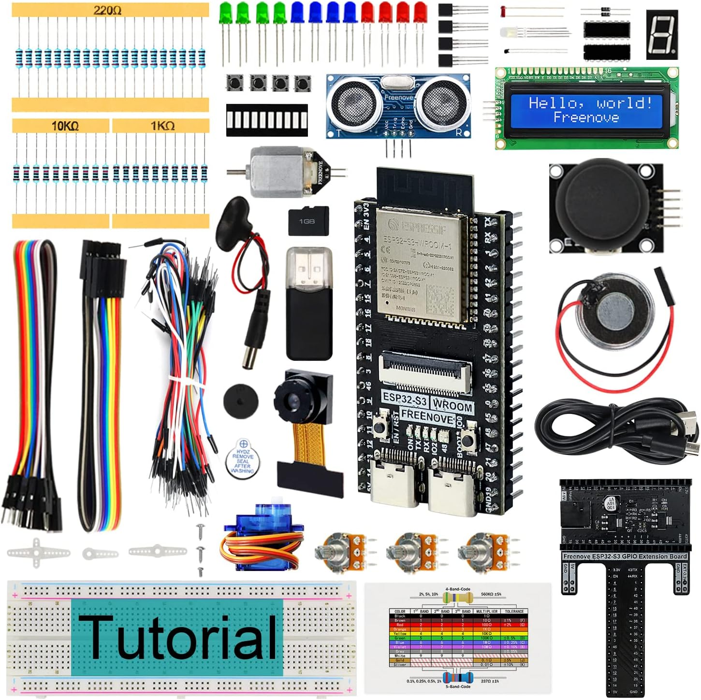

## Aquiring ESP32:
```06/11/2024```

After receiving my ESP32, I began working through the included tutorial materials to learn C++ programming. I prioritised examples that I believed would be most beneficial to me, such as:

1. Blinking LEDs: A simple project that uses ESP32-S3 WROOM to control blinking a common LED.
2. Doorbell: A simple project that detects when a button is pressed, resulting in a buzzer sound; and when the button is released, the buzzer stops sounding.
3. Client connection: Introduces how the ESP32-S3 implements network communications based on TCP/IP protocol.
4. Server machine: Introduces how the ESP32-S3 can be used as a server to wait for the connection and communication of client on the same LAN.
5. Camera web server: Describes how to connect the ESP32-S3 using USB and check its IP address through serial monitor. Use web page to access IP address to obtain video and image data.

Upon completion, I felt confident that I could use the ESP32 camera as a replacement for the weight scale I had initially planned. I envisioned using image recognition to count the number of vapes within the camera's field of view.

# Gemini Image Recognition implementation:

## C++?
```07/11/2024```

I started off by trying to implement the Gemini web API locally on the ESP32, but I immediately ran into several challenges. The first major hurdle was the lack of comprehensive documentation specifically tailored to this use case. While the Gemini API documentation is available, it's primarily focused on server-side implementation and lacks detailed guidance for resource-constrained devices like the ESP32.

Another significant obstacle was the ESP32's processing limitations. Running a full-fledged web API on such a device is demanding, and the performance overhead can impact real-time image processing and network operations. This constraint necessitated careful consideration of the API's functionality and optimization techniques to ensure smooth operation.

Networking issues also posed a challenge. The ESP32's Wi-Fi capabilities, while sufficient for basic connectivity, can be unreliable in certain environments. Factors like network congestion, interference, and router configuration can significantly affect the API's performance and responsiveness. Implementing robust error handling and retry mechanisms became crucial to mitigate these network-related problems.

Furthermore, I discovered that no one else seemed to have attempted a similar implementation. This absence of existing tutorials or community support meant I had to navigate the challenges independently, relying solely on the official Gemini API documentation and general ESP32 programming knowledge.

To overcome these limitations, I decided to adopt a hybrid approach. I plan to offload the majority of the API's processing and storage responsibilities to a local server. The ESP32 will serve as a lightweight client, capturing images and sending them to the server for analysis. The server will then process the images, delete old images, and provide a response to the ESP32.

## C++, PHP, JavaScript?
```10/11/2024```

My first hurdle involved creating an ESP32 program to upload captured images to a locally hosted LAMP server. Fortunately, I found a valuable resource in a tutorial by [RandomNerdTutorials.](https://randomnerdtutorials.com/esp32-cam-post-image-photo-server/) Which describes how to make HTTP POST requests using the ESP32-CAM board with Arduino IDE to send photos to a server. This tutorial detailed using the ESP32-CAM board and Arduino IDE to send photos to a server via HTTP POST requests.

However, the tutorial's goal was to create a photo gallery. Modifying it to suit my needs meant streamlining the process to handle a single image file at a time, with the option for later deletion. I ended up coming up with this:

### PHP:
```PHP:
<?php
if (!empty($_FILES["imageFile"]["name"])) {
  $target_dir = "uploads/";
  $target_file = $target_dir . basename($_FILES["imageFile"]["name"]);
  echo($target_file);
  $uploadOk = 1;
  $imageFileType = strtolower(pathinfo($target_file,PATHINFO_EXTENSION));

  // Check if image file is a actual image or fake image
  if(isset($_POST["submit"])) {
    
    $check = getimagesize($_FILES["imageFile"]["tmp_name"]);
    if($check !== false) {
      echo "File is an image - " . $check["mime"] . ".";
      $uploadOk = 1;
    }
    else {
      echo "File is not an image.";
      $uploadOk = 0;
    }
  }

  // Check if file already exists
  if (file_exists($target_file)) {
    echo "Sorry, file already exists.";
    $uploadOk = 0;
  }

  // Check file size
  if ($_FILES["imageFile"]["size"] > 500000) {
    echo "Sorry, your file is too large.";
    $uploadOk = 0;
  }

  // Allow certain file formats
  if($imageFileType != "jpg" && $imageFileType != "png" && $imageFileType != "jpeg"
  && $imageFileType != "gif" ) {
    echo "Sorry, only JPG, JPEG, PNG & GIF files are allowed.";
    $uploadOk = 0;
  }

  // Check if $uploadOk is set to 0 by an error
  if ($uploadOk == 0) {
    echo "Sorry, your file was not uploaded.";
  // if everything is ok, try to upload file
  }
  else {
    $uploadDirectory = realpath(dirname(__FILE__)).DIRECTORY_SEPARATOR .'uploads';
    $filePath = $uploadDirectory .DIRECTORY_SEPARATOR. basename($_FILES["imageFile"]["name"]);
    if (move_uploaded_file($_FILES["imageFile"]["tmp_name"], $target_file)) {
      echo "The file ". basename( $_FILES["imageFile"]["name"]). " has been uploaded.\n";
    }
    else {
      echo "Sorry, there was an error uploading your file.";
    }
  }
}
?>
```
### C++
```C++:
#include <Arduino.h>
#include <WiFi.h>
#include "esp_camera.h"

const char* ssid = "REPLACE_WITH_YOUR_SSID";
const char* password = "REPLACE_WITH_YOUR_PASSWORD";

String serverName = "192.168.1.XXX";   // REPLACE WITH YOUR Raspberry Pi IP ADDRESS
//String serverName = "example.com";   // OR REPLACE WITH YOUR DOMAIN NAME

String serverPath = "/upload.php";     // The default serverPath should be upload.php

const int serverPort = 80;

WiFiClient client;

//CAMERA_MODEL_ESP32S3_EYE
#define PWDN_GPIO_NUM -1
#define RESET_GPIO_NUM -1
#define XCLK_GPIO_NUM 15
#define SIOD_GPIO_NUM 4
#define SIOC_GPIO_NUM 5
#define Y2_GPIO_NUM 11
#define Y3_GPIO_NUM 9
#define Y4_GPIO_NUM 8
#define Y5_GPIO_NUM 10
#define Y6_GPIO_NUM 12
#define Y7_GPIO_NUM 18
#define Y8_GPIO_NUM 17
#define Y9_GPIO_NUM 16
#define VSYNC_GPIO_NUM 6
#define HREF_GPIO_NUM 7
#define PCLK_GPIO_NUM 13

const int timerInterval = 30000;    // time between each HTTP POST image
unsigned long previousMillis = 0;   // last time image was sent

void setup() {
  Serial.begin(115200);
  WiFi.mode(WIFI_STA);
  Serial.println();
  Serial.print("Connecting to ");
  Serial.println(ssid);
  WiFi.begin(ssid, password);  
  while (WiFi.status() != WL_CONNECTED) {
    Serial.print(".");
    delay(500);
  }
  Serial.println();
  Serial.print("ESP32-CAM IP Address: ");
  Serial.println(WiFi.localIP());

  camera_config_t config;
  config.ledc_channel = LEDC_CHANNEL_0;
  config.ledc_timer = LEDC_TIMER_0;
  config.pin_d0 = Y2_GPIO_NUM;
  config.pin_d1 = Y3_GPIO_NUM;
  config.pin_d2 = Y4_GPIO_NUM;
  config.pin_d3 = Y5_GPIO_NUM;
  config.pin_d4 = Y6_GPIO_NUM;
  config.pin_d5 = Y7_GPIO_NUM;
  config.pin_d6 = Y8_GPIO_NUM;
  config.pin_d7 = Y9_GPIO_NUM;
  config.pin_xclk = XCLK_GPIO_NUM;
  config.pin_pclk = PCLK_GPIO_NUM;
  config.pin_vsync = VSYNC_GPIO_NUM;
  config.pin_href = HREF_GPIO_NUM;
  config.pin_sccb_sda = SIOD_GPIO_NUM;
  config.pin_sccb_scl = SIOC_GPIO_NUM;
  config.pin_pwdn = PWDN_GPIO_NUM;
  config.pin_reset = RESET_GPIO_NUM;
  config.xclk_freq_hz = 20000000;
  config.pixel_format = PIXFORMAT_JPEG;

  // init with high specs to pre-allocate larger buffers
  if(psramFound()){
    config.frame_size = FRAMESIZE_SVGA;
    config.jpeg_quality = 10;  //0-63 lower number means higher quality
    config.fb_count = 2;
  } else {
    config.frame_size = FRAMESIZE_CIF;
    config.jpeg_quality = 12;  //0-63 lower number means higher quality
    config.fb_count = 1;
  }
  
  // camera init
  esp_err_t err = esp_camera_init(&config);
  if (err != ESP_OK) {
    Serial.printf("Camera init failed with error 0x%x", err);
    delay(1000);
    ESP.restart();
  }

  sendPhoto(); 
}

void loop() {
  unsigned long currentMillis = millis();
  if (currentMillis - previousMillis >= timerInterval) {
    sendPhoto();
    previousMillis = currentMillis;
  }
}

String sendPhoto() {
  String getAll;
  String getBody;

  camera_fb_t * fb = NULL;
  fb = esp_camera_fb_get();
  if(!fb) {
    Serial.println("Camera capture failed");
    delay(1000);
    ESP.restart();
  }
  
  Serial.println("Connecting to server: " + serverName);

  if (client.connect(serverName.c_str(), serverPort)) {
    Serial.println("Connection successful!");    
    String head = "--RandomNerdTutorials\r\nContent-Disposition: form-data; name=\"imageFile\"; filename=\"esp32-cam.jpg\"\r\nContent-Type: image/jpeg\r\n\r\n";
    String tail = "\r\n--RandomNerdTutorials--\r\n";

    uint32_t imageLen = fb->len;
    uint32_t extraLen = head.length() + tail.length();
    uint32_t totalLen = imageLen + extraLen;
  
    client.println("POST " + serverPath + " HTTP/1.1");
    client.println("Host: " + serverName);
    client.println("Content-Length: " + String(totalLen));
    client.println("Content-Type: multipart/form-data; boundary=RandomNerdTutorials");
    client.println();
    client.print(head);
  
    uint8_t *fbBuf = fb->buf;
    size_t fbLen = fb->len;
    for (size_t n=0; n<fbLen; n=n+1024) {
      if (n+1024 < fbLen) {
        client.write(fbBuf, 1024);
        fbBuf += 1024;
      }
      else if (fbLen%1024>0) {
        size_t remainder = fbLen%1024;
        client.write(fbBuf, remainder);
      }
    }   
    client.print(tail);
    
    esp_camera_fb_return(fb);
    
    int timoutTimer = 10000;
    long startTimer = millis();
    boolean state = false;
    
    while ((startTimer + timoutTimer) > millis()) {
      Serial.print(".");
      delay(100);      
      while (client.available()) {
        char c = client.read();
        if (c == '\n') {
          if (getAll.length()==0) { state=true; }
          getAll = "";
        }
        else if (c != '\r') { getAll += String(c); }
        if (state==true) { getBody += String(c); }
        startTimer = millis();
      }
      if (getBody.length()>0) { break; }
    }
    Serial.println();
    client.stop();
    Serial.println(getBody);
  }
  else {
    getBody = "Connection to " + serverName +  " failed.";
    Serial.println(getBody);
  }
  return getBody;
}
```

*Note: I got stuck for a whole day trying to figure out why the tutorial code boot loops my ESP32, I eventually figured out its:*
```
#include "soc/soc.h"
#include "soc/rtc_cntl_reg.h"
WRITE_PERI_REG(RTC_CNTL_BROWN_OUT_REG, 0);
```
## JavaScript/NodeJS Fail:
```12/11/2024```

After successfully establishing the image upload mechanism, the next challenge was to analyse the image content. Initially, I considered using JavaScript for this task. However, the inherent limitation of direct communication between JavaScript running in the browser and PHP on the server presented a significant obstacle. Workarounds like storing the image in the PHP session and then accessing it using an AJAX request from JavaScript proved to be ineffective.

Given the limitations of direct JavaScript-PHP communication, I decided to explore alternative approaches. One promising option was to leverage a PHP-based Gemini API, found [here](https://github.com/gemini-api-php/client), to send image analysis requests. However, I encountered compatibility issues with Gemini 1.5 Flash. This specific version presented challenges in terms of image processing capabilities and the integration of external libraries required for sending both image analysis and a prompt, which is what I needed.

## $CURL Solution:
```15/11/2024```

After two days of searching I have managed to find an alternative solution posted on [squarepoint.net](https://www.squarepoint.net/how-to-use-vision-capabilities-with-gemini-and-php/), which has allowed me to send API requests using $CURL:

### PHP:
```PHP:
require "vendor/autoload.php";
define('GEMINI_API_KEY','MyAPIKey');
define('MODEL','gemini-1.5-flash-latest');
define('BASEURL', 'https://generativelanguage.googleapis.com/v1beta');
function generateContent($textPrompt,$imagePrompt,$imageType)
{
    $text = filter_var($textPrompt, FILTER_SANITIZE_STRING);
    //combine the base url with preferred model and api key
    $url = sprintf("%s/models/%s:generateContent?key=%s",BASEURL,MODEL,GEMINI_API_KEY);
     
    $data = [
        "contents" => [
            "parts" => [
                [
                    "inlineData" => [
                        "mimeType" => $imageType,
                        "data" => $imagePrompt
                    ]
                ],
                [
                    "text" => $text
                ]
            ]
        ]
    ];
    
    $jsonData = json_encode($data);
    $ch = curl_init($url);
     
    curl_setopt($ch, CURLOPT_RETURNTRANSFER, true);
    curl_setopt($ch, CURLOPT_HTTPHEADER, ['Content-Type: application/json']);
    curl_setopt($ch, CURLOPT_POST, true);
    curl_setopt($ch, CURLOPT_POSTFIELDS, $jsonData);
 
    $response = curl_exec($ch);
 
    if (curl_errno($ch)) {
        echo 'Request error: ' . curl_error($ch);
    } else {
     $response = json_decode($response); 
 
     if (isset($response->candidates[0]->content->parts[0]->text)) {
        $text = $response->candidates[0]->content->parts[0]->text;
    }
  }
    curl_close($ch);
}
```

## Sending Data Back/Model:
```16/11/2024```

The assignment is a day overdue so I am quite stressed, I still need to implement the connection back to the ESP32 to control devices. However, there is little to no documentation to do this online looks like I will have to figure something out myself.

After some searching I was able to find an [article](https://medium.com/@cn0047/super-simple-php-websocket-example-ea2cd5893575) that shows how to create a websocket to send data across HTTP. After following this I realised that XAMPP did not have websockets enabled by default so I had to enable it by doing the following:

*Step 1:*
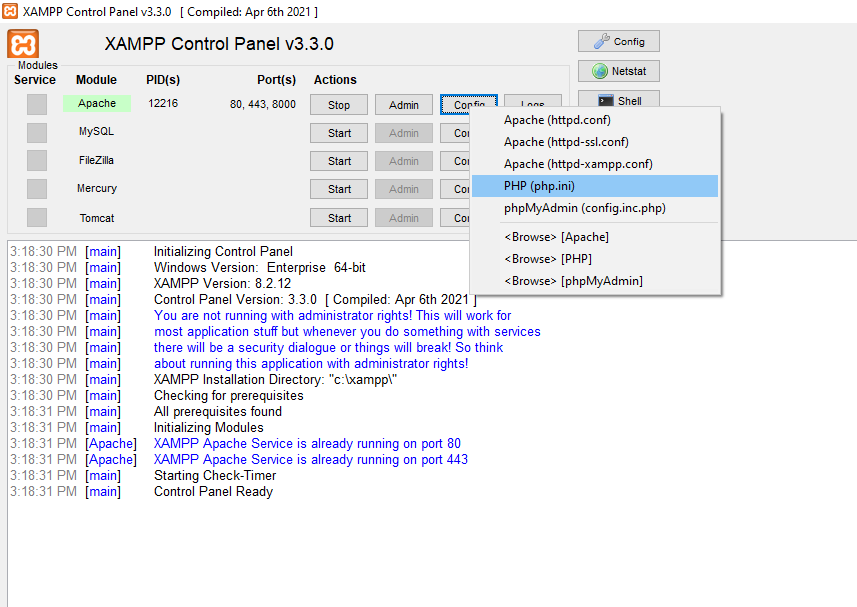

*Step 2:*
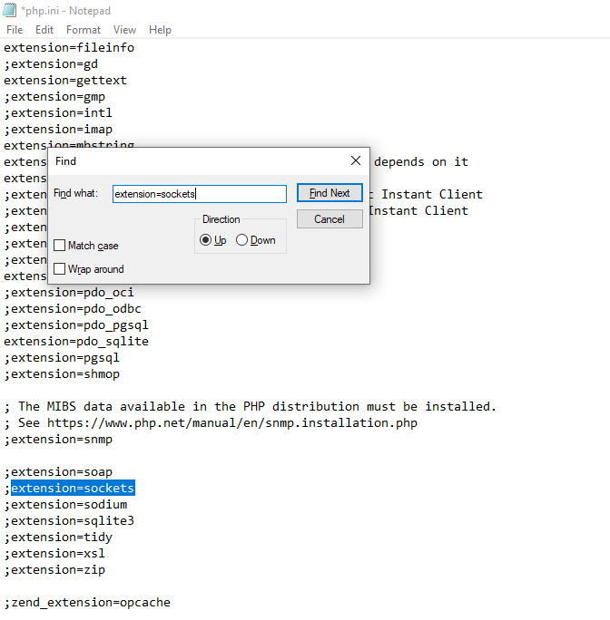

*Step 3:*


Once websockets were enabled, I wrote a function to send the response to the ESP32 on port 80 (the default HTTP port). After a response was received, the old image was deleted to allow for a new image to be sent:

```PHP:
function sendContent($dataToSend)
{
  echo('Sending data: '. $dataToSend);
  $host = "192.168.0.65";
  $port = 80; // Standard HTTP port
  
  // Create a socket connection
  $socket = socket_create(AF_INET, SOCK_STREAM, SOL_TCP);
  if (!$socket) {
    echo "socket_create() failed: " . socket_last_error() . PHP_EOL;
    exit;
  }
  
  // Connect to the ESP32 server
  if (!socket_connect($socket, $host, $port)) {
    echo "socket_connect() failed: " . socket_last_error() . PHP_EOL;
    exit;
  }
  
  // Send data to the ESP32
  $bytesSent = socket_write($socket, $dataToSend, strlen($dataToSend));
  if ($bytesSent === FALSE) {
    echo "socket_write() failed: " . socket_last_error() . PHP_EOL;
    exit;
  }
  echo "Sent " . $bytesSent . " bytes of data to ESP32." . PHP_EOL;
  
  // Optional: Receive response from the ESP32 (if implemented in the ESP32 code)
  $response = socket_read($socket, 1024); // Adjust buffer size as needed
  if ($response !== FALSE) {
    echo "Received response from ESP32: " . $response . PHP_EOL;
    if (file_exists('uploads\esp32-cam.jpeg')) {
      if (unlink('uploads\esp32-cam.jpeg')) {
          echo "File deleted successfully!";
      } else {
          echo "Error deleting file.";
      }
  } else {
      echo "File does not exist.";
  }
}
```

After this I was able to get data sent out from php, I tested this using WireShark:

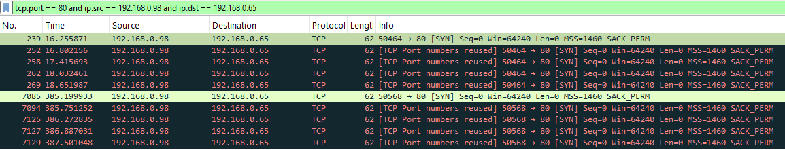

As the Wireshark capture shows, I still need to configure the ESP32 to listen on port 80. I've run out of time today, so I'll use the remaining time to create a small model for the art piece.

To begin, I printed a simple human figure, cut it out, and traced it onto XPS foam using a wire cutter:

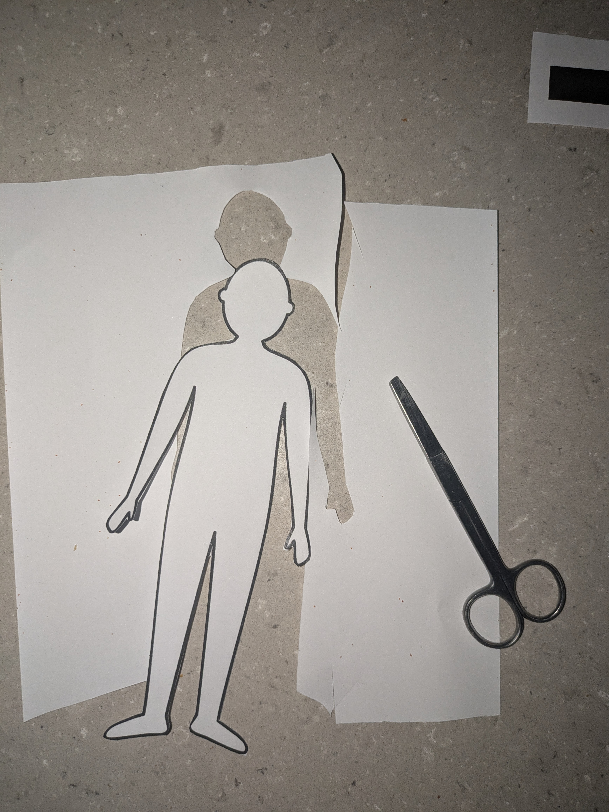

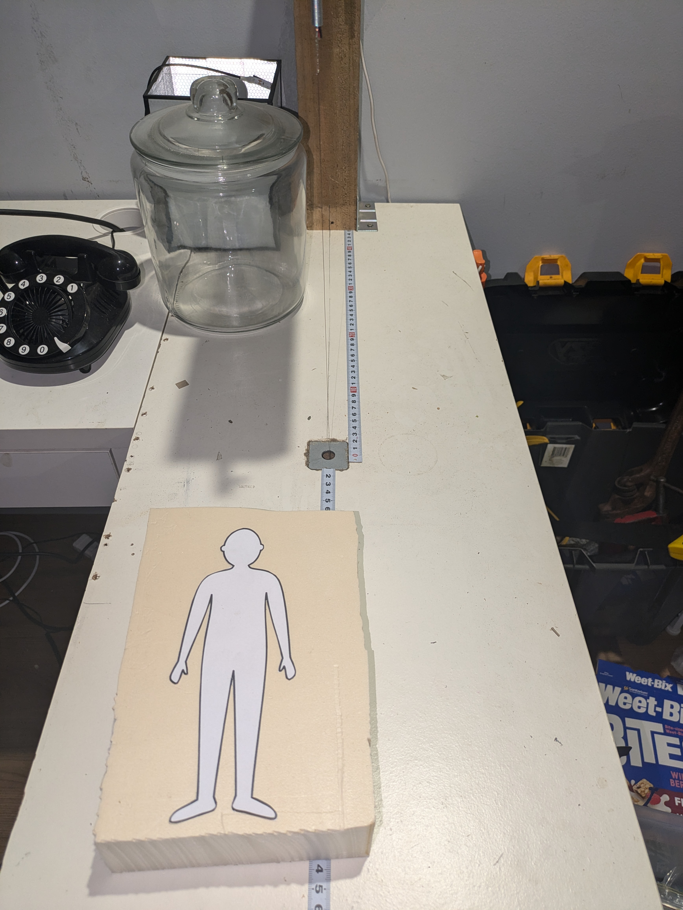

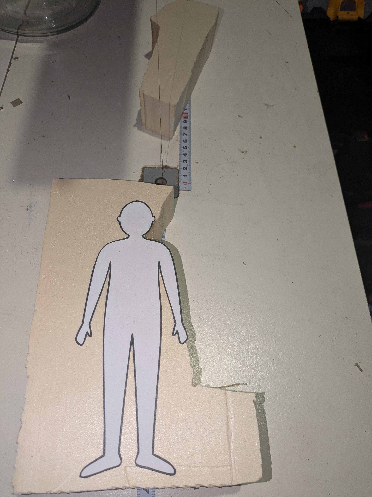

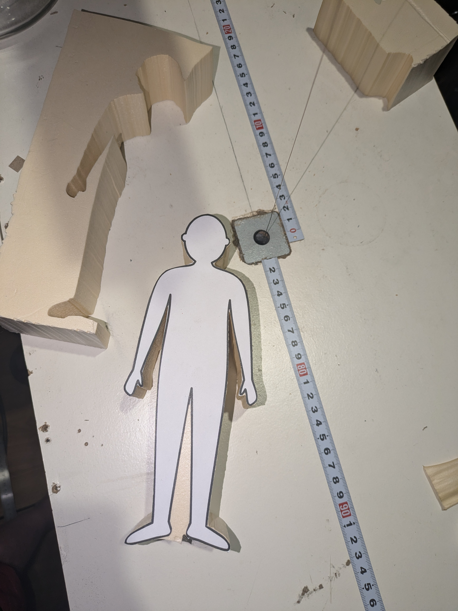

This gave me a large piece to work with so I decided to cut it in half

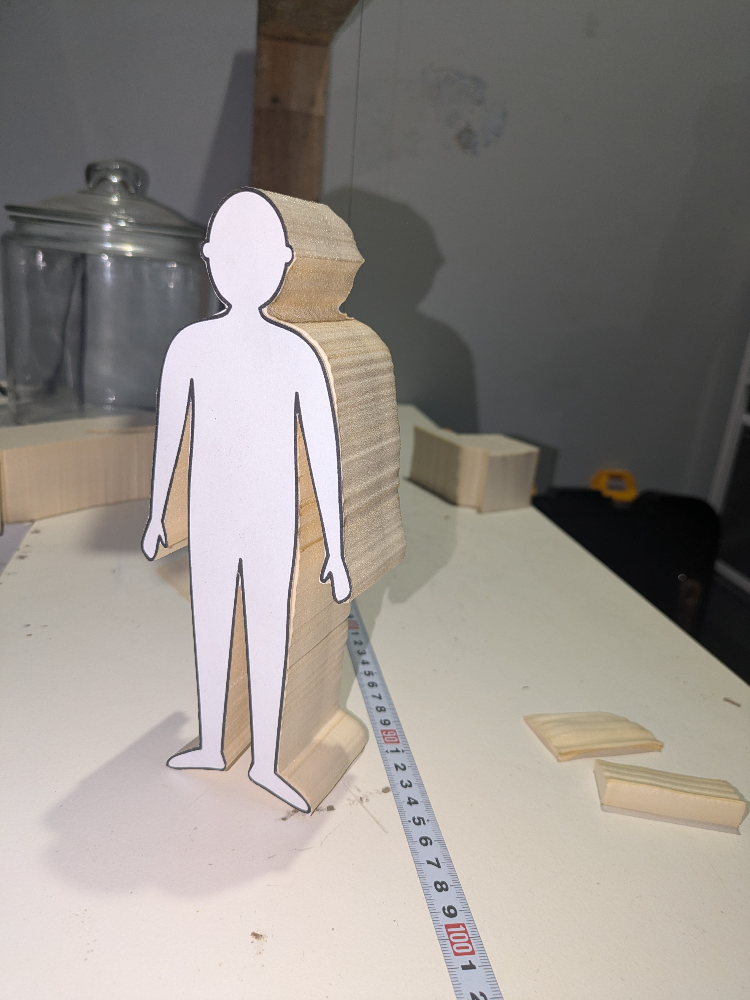

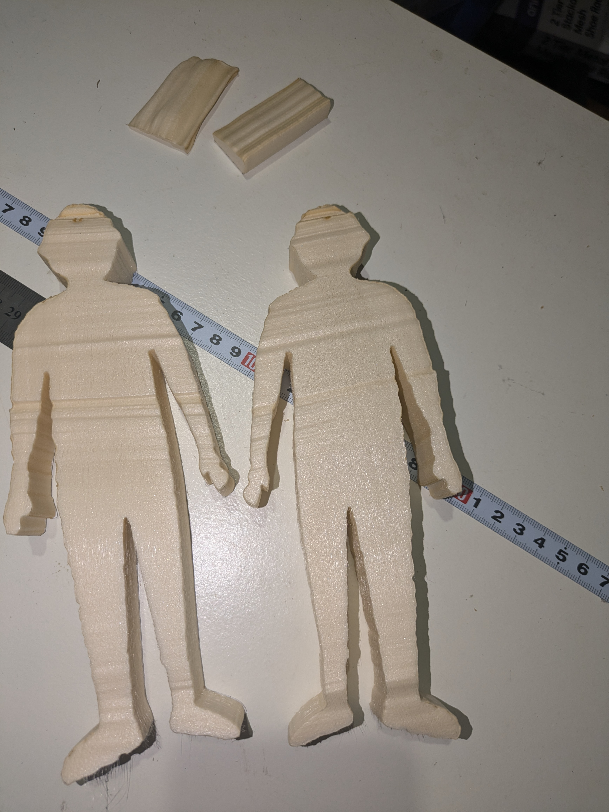

After practicing sanding with the first piece, I was able to get a pretty good figure with my second attempt on the second piece:

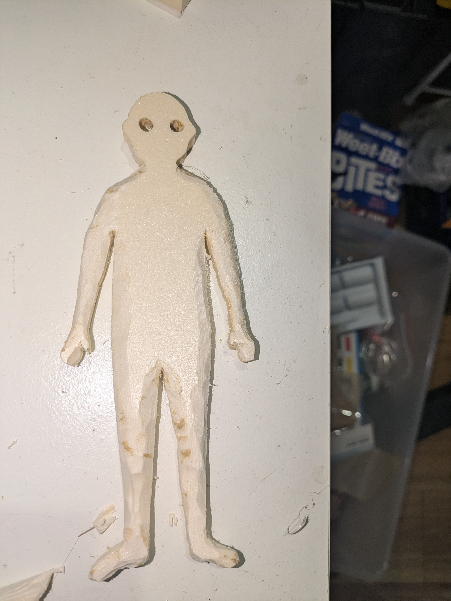

After model was finished I wired some lights to the eyes and put it on a box to act as a display stand:


## Receiving on the ESP32 part 1:
```17/11/2024```

I began with the previous code, but this time I decided to leverage the dual cores of the ESP32-S3 to separate the image sending and receiving tasks. I then used the WiFiServer library to configure the ESP32 to listen for incoming requests on port 80. Finally, I implemented a code segment within the 'serverTask' to monitor this port, process the received data (converting it from a string to an integer), and control the buzzer and lights accordingly.

```C++:

#include <Arduino.h>
#include <ArduinoJson.h>
#include <WiFi.h>
#include <WiFiClient.h>
#include <WiFiServer.h>
#include "esp_camera.h"
#include <FreeRTOS.h>
#include <task.h>
#include <iostream> // for std::stoi (assuming C++11 compiler)
#include <string>
#include <stdexcept> // for exception handling

TaskHandle_t captureTaskHandle;
TaskHandle_t serverTaskHandle;

const char* ssid = "ssid";
const char* password = "pass";

String serverName = "192.168.0.00";
String serverPath = "/image_server/index.php";
const int serverPort = 8000;

#define port 80


WiFiClient client;
WiFiServer server(port);
//CAMERA_MODEL_ESP32S3_EYE
#define PWDN_GPIO_NUM -1
#define RESET_GPIO_NUM -1
#define XCLK_GPIO_NUM 15
#define SIOD_GPIO_NUM 4
#define SIOC_GPIO_NUM 5
#define Y2_GPIO_NUM 11
#define Y3_GPIO_NUM 9
#define Y4_GPIO_NUM 8
#define Y5_GPIO_NUM 10
#define Y6_GPIO_NUM 12
#define Y7_GPIO_NUM 18
#define Y8_GPIO_NUM 17
#define Y9_GPIO_NUM 16
#define VSYNC_GPIO_NUM 6
#define HREF_GPIO_NUM 7
#define PCLK_GPIO_NUM 13
#define PIN_BUZZER 14
#define GREEN_LIGHT 1
#define RED_LIGHT 2


const int timerInterval = 30000;    // time between each HTTP POST image
const int startTone = 0;
const int maxTone = 20000;
unsigned long requiredResponse = 1;
unsigned long buzzertone = 0;
unsigned long lastClientConnectionTime = 0;

void setup() {
  Serial.begin(115200);
  pinMode(PIN_BUZZER, OUTPUT);
  pinMode(RED_LIGHT, OUTPUT);
  pinMode(GREEN_LIGHT, OUTPUT);
  tone(PIN_BUZZER, 0, timerInterval);
  WiFi.mode(WIFI_STA);
  Serial.println();
  Serial.print("Connecting to ");
  Serial.println(ssid);
  WiFi.begin(ssid, password);  
  while (WiFi.status() != WL_CONNECTED) {
    Serial.print(".");
    delay(500);
  }
  Serial.println();
  Serial.print("ESP32-CAM IP Address: ");
  Serial.println(WiFi.localIP());
  server.begin();
  
  camera_config_t config;
  config.ledc_channel = LEDC_CHANNEL_0;
  config.ledc_timer = LEDC_TIMER_0;
  config.pin_d0 = Y2_GPIO_NUM;
  config.pin_d1 = Y3_GPIO_NUM;
  config.pin_d2 = Y4_GPIO_NUM;
  config.pin_d3 = Y5_GPIO_NUM;
  config.pin_d4 = Y6_GPIO_NUM;
  config.pin_d5 = Y7_GPIO_NUM;
  config.pin_d6 = Y8_GPIO_NUM;
  config.pin_d7 = Y9_GPIO_NUM;
  config.pin_xclk = XCLK_GPIO_NUM;
  config.pin_pclk = PCLK_GPIO_NUM;
  config.pin_vsync = VSYNC_GPIO_NUM;
  config.pin_href = HREF_GPIO_NUM;
  config.pin_sccb_sda = SIOD_GPIO_NUM;
  config.pin_sccb_scl = SIOC_GPIO_NUM;
  config.pin_pwdn = PWDN_GPIO_NUM;
  config.pin_reset = RESET_GPIO_NUM;
  config.xclk_freq_hz = 20000000;
  config.pixel_format = PIXFORMAT_JPEG;

  // init with high specs to pre-allocate larger buffers
  if(psramFound()){
    config.frame_size = FRAMESIZE_SVGA;
    config.jpeg_quality = 5;  //0-63 lower number means higher quality
    config.fb_count = 1;
  } else {
    config.frame_size = FRAMESIZE_CIF;
    config.jpeg_quality = 12;  //0-63 lower number means higher quality
    config.fb_count = 1;
  }
  
  // camera init
  esp_err_t err = esp_camera_init(&config);
  if (err != ESP_OK) {
    Serial.printf("Camera init failed with error 0x%x", err);
    delay(1000);
    ESP.restart();
  }
  // Create capture task on core 0 (optional, adjust based on needs)
  xTaskCreate(captureTask, "Capture Task", 4096, NULL, 1, &captureTaskHandle);

  // Optional: Create server task on core 1 (optional, adjust based on needs)
  xTaskCreate(serverTask, "Server Task", 2048, NULL, 1, &serverTaskHandle);
  sendPhoto(); 
}

void captureTask(void *pvParameters) {
  // Code for capturing image and sending to server
  while (1) {
    // Capture image logic
    String response = sendPhoto();
    Serial.println("Image sent.");
    vTaskDelay(pdMS_TO_TICKS(timerInterval));  // Delay between captures
  }
}

void serverTask(void *pvParameters) {
  while (1) {
  // Code for handling incoming connections to the ESP32
  WiFiClient client = server.available(); // Wait for incoming connections
  if (client) {
    Serial.println("Client connected.");
    // Receive data from the client (PHP script)
    std::string receivedData = "";
    while (client.connected() && client.available()) {
      char c = client.read();
      receivedData += c;
    }
    int processedData = 0;
    try {
      processedData = std::stoi(receivedData);
    } catch (const std::invalid_argument& e) {
      Serial.println("Invalid data received: Not a number");
    } catch (const std::out_of_range& e) {
      Serial.println("Data out of range: Too large or too small");
    }
    if (maxTone > buzzertone) {
      buzzertone += 200;
    }
    if (processedData >= requiredResponse) {
      tone(PIN_BUZZER, 0, timerInterval);
      digitalWrite(RED_LIGHT, LOW);
      digitalWrite(GREEN_LIGHT, HIGH);
      if (millis() - lastClientConnectionTime >= 1 * 60 * 1000) {
      requiredResponse++;
      lastClientConnectionTime = millis(); // Update timestamp
      }
    }
    else {
      tone(PIN_BUZZER, buzzertone, timerInterval);
      digitalWrite(RED_LIGHT, HIGH);
      digitalWrite(GREEN_LIGHT, LOW);
    }
    // Check if 5 minutes have passed since the last connection
    client.stop(); // Close the connection
    Serial.println("Client disconnected.");
    }
    vTaskDelay(pdMS_TO_TICKS(100));  // Delay for server task
    }
}

void loop() {
}

String sendPhoto() {
  String getAll;
  String getBody;

  camera_fb_t * fb = NULL;
  fb = esp_camera_fb_get();
  esp_camera_fb_return(fb); // dispose of the buffered image
  fb = NULL; // reset to capture errors
  fb = esp_camera_fb_get(); // get fresh image
  if(!fb) {
    Serial.println("Camera capture failed");
    delay(1000);
    ESP.restart();
  }
  
  Serial.println("Connecting to server: " + serverName);

  if (client.connect(serverName.c_str(), serverPort)) {
    Serial.println("Connection successful!");    
    String head = "--RandomNerdTutorials\r\nContent-Disposition: form-data; name=\"imageFile\"; filename=\"esp32-cam.jpeg\"\r\nContent-Type: image/jpeg\r\n\r\n";
    String tail = "\r\n--RandomNerdTutorials--\r\n";

    uint32_t imageLen = fb->len;
    uint32_t extraLen = head.length() + tail.length();
    uint32_t totalLen = imageLen + extraLen;
  
    client.println("POST " + serverPath + " HTTP/1.1");
    client.println("Host: " + serverName);
    client.println("Content-Length: " + String(totalLen));
    client.println("Content-Type: multipart/form-data; boundary=RandomNerdTutorials");
    client.println();
    client.print(head);
  
    uint8_t *fbBuf = fb->buf;
    size_t fbLen = fb->len;
    for (size_t n=0; n<fbLen; n=n+1024) {
      if (n+1024 < fbLen) {
        client.write(fbBuf, 1024);
        fbBuf += 1024;
      }
      else if (fbLen%1024>0) {
        size_t remainder = fbLen%1024;
        client.write(fbBuf, remainder);
      }
    }   
    client.print(tail);
    
    esp_camera_fb_return(fb);
    
    int timoutTimer = 10000;
    long startTimer = millis();
    boolean state = false;
    
    while ((startTimer + timoutTimer) > millis()) {
      Serial.print(".");
      delay(100);      
      while (client.available()) {
        char c = client.read();
        if (c == '\n') {
          if (getAll.length()==0) { state=true; }
          getAll = "";
        }
        else if (c != '\r') { getAll += String(c); }
        if (state==true) { getBody += String(c); }
        startTimer = millis();
      }
      if (getBody.length()>0) { break; }
    }
    Serial.println();
    client.stop();
    Serial.println(getBody);
  }
  else {
    getBody = "Connection to " + serverName +  " failed.";
    Serial.println(getBody);
  }
  return getBody;
}
```

## Receiving on the ESP32 part 2:

```19/11/2024```

The final code for both  XAMPP and the ESP32:

### PHP:
```PHP:
<?php
require "vendor/autoload.php";
define('GEMINI_API_KEY','MyApiKey');
define('MODEL','gemini-1.5-flash-latest');
define('BASEURL', 'https://generativelanguage.googleapis.com/v1beta');
function sendContent($dataToSend)
{
  echo('Sending data: '. $dataToSend);
  $host = "192.168.0.00";
  $port = 80; // Standard HTTP port
  
  // Create a socket connection
  $socket = socket_create(AF_INET, SOCK_STREAM, SOL_TCP);
  if (!$socket) {
    echo "socket_create() failed: " . socket_last_error() . PHP_EOL;
    exit;
  }
  
  // Connect to the ESP32 server
  if (!socket_connect($socket, $host, $port)) {
    echo "socket_connect() failed: " . socket_last_error() . PHP_EOL;
    exit;
  }
  
  // Send data to the ESP32
  $bytesSent = socket_write($socket, $dataToSend, strlen($dataToSend));
  if ($bytesSent === FALSE) {
    echo "socket_write() failed: " . socket_last_error() . PHP_EOL;
    exit;
  }
  echo "Sent " . $bytesSent . " bytes of data to ESP32." . PHP_EOL;
  
  // Optional: Receive response from the ESP32 (if implemented in the ESP32 code)
  $response = socket_read($socket, 1024); // Adjust buffer size as needed
  if ($response !== FALSE) {
    echo "Received response from ESP32: " . $response . PHP_EOL;
    if (file_exists('uploads\esp32-cam.jpeg')) {
      if (unlink('uploads\esp32-cam.jpeg')) {
          echo "File deleted successfully!";
      } else {
          echo "Error deleting file.";
      }
  } else {
      echo "File does not exist.";
  }
}
  
  // Close the socket connection
  socket_close($socket);
}
function generateContent($textPrompt,$imagePrompt,$imageType)
{
    $text = filter_var($textPrompt, FILTER_SANITIZE_STRING);
    //combine the base url with preferred model and api key
    $url = sprintf("%s/models/%s:generateContent?key=%s",BASEURL,MODEL,GEMINI_API_KEY);
     
    $data = [
        "contents" => [
            "parts" => [
                [
                    "inlineData" => [
                        "mimeType" => $imageType,
                        "data" => $imagePrompt
                    ]
                ],
                [
                    "text" => $text
                ]
            ]
        ]
    ];
    
    $jsonData = json_encode($data);
    $ch = curl_init($url);
     
    curl_setopt($ch, CURLOPT_RETURNTRANSFER, true);
    curl_setopt($ch, CURLOPT_HTTPHEADER, ['Content-Type: application/json']);
    curl_setopt($ch, CURLOPT_POST, true);
    curl_setopt($ch, CURLOPT_POSTFIELDS, $jsonData);
 
    $response = curl_exec($ch);
 
    if (curl_errno($ch)) {
        echo 'Request error: ' . curl_error($ch);
    } else {
     $response = json_decode($response); 
 
     if (isset($response->candidates[0]->content->parts[0]->text)) {
        $text = $response->candidates[0]->content->parts[0]->text;
        // Remove non-numeric characters using regular expression
        $numeric_string = preg_replace('/[^0-9]/', '', $text);
        $int_value = intval($numeric_string);
        sendContent($int_value);
    }
  }
    curl_close($ch);
}

if (!empty($_FILES["imageFile"]["name"])) {
  $target_dir = "uploads/";
  $target_file = $target_dir . basename($_FILES["imageFile"]["name"]);
  echo($target_file);
  $uploadOk = 1;
  $imageFileType = strtolower(pathinfo($target_file,PATHINFO_EXTENSION));

  // Check if image file is a actual image or fake image
  if(isset($_POST["submit"])) {
    
    $check = getimagesize($_FILES["imageFile"]["tmp_name"]);
    if($check !== false) {
      echo "File is an image - " . $check["mime"] . ".";
      $uploadOk = 1;
    }
    else {
      echo "File is not an image.";
      $uploadOk = 0;
    }
  }

  // Check if file already exists
  if (file_exists($target_file)) {
    echo "Sorry, file already exists.";
    $uploadOk = 0;
  }

  // Check file size
  if ($_FILES["imageFile"]["size"] > 500000) {
    echo "Sorry, your file is too large.";
    $uploadOk = 0;
  }

  // Allow certain file formats
  if($imageFileType != "jpg" && $imageFileType != "png" && $imageFileType != "jpeg"
  && $imageFileType != "gif" ) {
    echo "Sorry, only JPG, JPEG, PNG & GIF files are allowed.";
    $uploadOk = 0;
  }

  // Check if $uploadOk is set to 0 by an error
  if ($uploadOk == 0) {
    echo "Sorry, your file was not uploaded.";
  // if everything is ok, try to upload file
  }
  else {
    $uploadDirectory = realpath(dirname(__FILE__)).DIRECTORY_SEPARATOR .'uploads';
    $filePath = $uploadDirectory .DIRECTORY_SEPARATOR. basename($_FILES["imageFile"]["name"]);
    if (move_uploaded_file($_FILES["imageFile"]["tmp_name"], $target_file)) {
      echo "The file ". basename( $_FILES["imageFile"]["name"]). " has been uploaded.\n";
      $text = 'How many vapes are in this image? return either the number of vapes or zero as one value';
      $image = base64_encode(file_get_contents($filePath));
      $fileMimeType = 'image/jpeg';
      generateContent($text,$image,$fileMimeType);
    }
    else {
      echo "Sorry, there was an error uploading your file.";
    }
  }
}
?>
```
### ESP32:
```C++:
#include <Arduino.h>
#include <ArduinoJson.h>
#include <WiFi.h>
#include <WiFiClient.h>
#include <WiFiServer.h>
#include "esp_camera.h"
#include <FreeRTOS.h>
#include <task.h>
#include <iostream> // for std::stoi (assuming C++11 compiler)
#include <string>
#include <stdexcept> // for exception handling

TaskHandle_t captureTaskHandle;
TaskHandle_t serverTaskHandle;

const char* ssid = "ssid";
const char* password = "pass";

String serverName = "192.168.0.00";
String serverPath = "/image_server/index.php";
const int serverPort = 8000;

#define port 80


WiFiClient client;
WiFiServer server(port);
//CAMERA_MODEL_ESP32S3_EYE
#define PWDN_GPIO_NUM -1
#define RESET_GPIO_NUM -1
#define XCLK_GPIO_NUM 15
#define SIOD_GPIO_NUM 4
#define SIOC_GPIO_NUM 5
#define Y2_GPIO_NUM 11
#define Y3_GPIO_NUM 9
#define Y4_GPIO_NUM 8
#define Y5_GPIO_NUM 10
#define Y6_GPIO_NUM 12
#define Y7_GPIO_NUM 18
#define Y8_GPIO_NUM 17
#define Y9_GPIO_NUM 16
#define VSYNC_GPIO_NUM 6
#define HREF_GPIO_NUM 7
#define PCLK_GPIO_NUM 13
#define PIN_BUZZER 14
#define GREEN_LIGHT 1
#define RED_LIGHT 2


const int timerInterval = 30000;
const int startTone = 0;
const int maxTone = 20000;
unsigned long requiredResponse = 1;
unsigned long buzzertone = 0;
unsigned long lastClientConnectionTime = 0;

void setup() {
  Serial.begin(115200);
  pinMode(PIN_BUZZER, OUTPUT);
  pinMode(RED_LIGHT, OUTPUT);
  pinMode(GREEN_LIGHT, OUTPUT);
  tone(PIN_BUZZER, 0, timerInterval);
  WiFi.mode(WIFI_STA);
  Serial.println();
  Serial.print("Connecting to ");
  Serial.println(ssid);
  WiFi.begin(ssid, password);  
  while (WiFi.status() != WL_CONNECTED) {
    Serial.print(".");
    delay(500);
  }
  Serial.println();
  Serial.print("ESP32-CAM IP Address: ");
  Serial.println(WiFi.localIP());
  server.begin();
  
  camera_config_t config;
  config.ledc_channel = LEDC_CHANNEL_0;
  config.ledc_timer = LEDC_TIMER_0;
  config.pin_d0 = Y2_GPIO_NUM;
  config.pin_d1 = Y3_GPIO_NUM;
  config.pin_d2 = Y4_GPIO_NUM;
  config.pin_d3 = Y5_GPIO_NUM;
  config.pin_d4 = Y6_GPIO_NUM;
  config.pin_d5 = Y7_GPIO_NUM;
  config.pin_d6 = Y8_GPIO_NUM;
  config.pin_d7 = Y9_GPIO_NUM;
  config.pin_xclk = XCLK_GPIO_NUM;
  config.pin_pclk = PCLK_GPIO_NUM;
  config.pin_vsync = VSYNC_GPIO_NUM;
  config.pin_href = HREF_GPIO_NUM;
  config.pin_sccb_sda = SIOD_GPIO_NUM;
  config.pin_sccb_scl = SIOC_GPIO_NUM;
  config.pin_pwdn = PWDN_GPIO_NUM;
  config.pin_reset = RESET_GPIO_NUM;
  config.xclk_freq_hz = 20000000;
  config.pixel_format = PIXFORMAT_JPEG;

  // init with high specs to pre-allocate larger buffers
  if(psramFound()){
    config.frame_size = FRAMESIZE_SVGA;
    config.jpeg_quality = 5;  //0-63 lower number means higher quality
    config.fb_count = 1;
  } else {
    config.frame_size = FRAMESIZE_CIF;
    config.jpeg_quality = 12;  //0-63 lower number means higher quality
    config.fb_count = 1;
  }
  
  // camera init
  esp_err_t err = esp_camera_init(&config);
  if (err != ESP_OK) {
    Serial.printf("Camera init failed with error 0x%x", err);
    delay(1000);
    ESP.restart();
  }
  // Create capture task on core 0 (optional, adjust based on needs)
  xTaskCreate(captureTask, "Capture Task", 4096, NULL, 1, &captureTaskHandle);

  // Optional: Create server task on core 1 (optional, adjust based on needs)
  xTaskCreate(serverTask, "Server Task", 2048, NULL, 1, &serverTaskHandle);
  sendPhoto(); 
}

void captureTask(void *pvParameters) {
  // Code for capturing image and sending to server
  while (1) {
    // Capture image logic
    String response = sendPhoto();
    Serial.println("Image sent.");
    vTaskDelay(pdMS_TO_TICKS(timerInterval));  // Delay between captures
  }
}

void serverTask(void *pvParameters) {
  while (1) {
  // Code for handling incoming connections to the ESP32
  WiFiClient client = server.available(); // Wait for incoming connections
  if (client) {
    Serial.println("Client connected.");
    // Receive data from the client (PHP script)
    std::string receivedData = "";
    while (client.connected() && client.available()) {
      char c = client.read();
      receivedData += c;
    }
    int processedData = 0;
    try {
      processedData = std::stoi(receivedData);
    } catch (const std::invalid_argument& e) {
      Serial.println("Invalid data received: Not a number");
    } catch (const std::out_of_range& e) {
      Serial.println("Data out of range: Too large or too small");
    }
    if (maxTone > buzzertone) {
      buzzertone += 200;
    }
    if (processedData >= requiredResponse) {
      tone(PIN_BUZZER, 0, timerInterval);
      digitalWrite(RED_LIGHT, LOW);
      digitalWrite(GREEN_LIGHT, HIGH);
      if (millis() - lastClientConnectionTime >= 1 * 60 * 1000) {
      requiredResponse++;
      lastClientConnectionTime = millis(); // Update timestamp
      }
    }
    else {
      tone(PIN_BUZZER, buzzertone, timerInterval);
      digitalWrite(RED_LIGHT, HIGH);
      digitalWrite(GREEN_LIGHT, LOW);
    }
    // Check if 5 minutes have passed since the last connection
    client.stop(); // Close the connection
    Serial.println("Client disconnected.");
    }
    vTaskDelay(pdMS_TO_TICKS(100));  // Delay for server task
    }
}

void loop() {
}

String sendPhoto() {
  String getAll;
  String getBody;

  camera_fb_t * fb = NULL;
  fb = esp_camera_fb_get();
  esp_camera_fb_return(fb); // dispose of the buffered image
  fb = NULL; // reset to capture errors
  fb = esp_camera_fb_get(); // get fresh image
  if(!fb) {
    Serial.println("Camera capture failed");
    delay(1000);
    ESP.restart();
  }
  
  Serial.println("Connecting to server: " + serverName);

  if (client.connect(serverName.c_str(), serverPort)) {
    Serial.println("Connection successful!");    
    String head = "--RandomNerdTutorials\r\nContent-Disposition: form-data; name=\"imageFile\"; filename=\"esp32-cam.jpeg\"\r\nContent-Type: image/jpeg\r\n\r\n";
    String tail = "\r\n--RandomNerdTutorials--\r\n";

    uint32_t imageLen = fb->len;
    uint32_t extraLen = head.length() + tail.length();
    uint32_t totalLen = imageLen + extraLen;
  
    client.println("POST " + serverPath + " HTTP/1.1");
    client.println("Host: " + serverName);
    client.println("Content-Length: " + String(totalLen));
    client.println("Content-Type: multipart/form-data; boundary=RandomNerdTutorials");
    client.println();
    client.print(head);
  
    uint8_t *fbBuf = fb->buf;
    size_t fbLen = fb->len;
    for (size_t n=0; n<fbLen; n=n+1024) {
      if (n+1024 < fbLen) {
        client.write(fbBuf, 1024);
        fbBuf += 1024;
      }
      else if (fbLen%1024>0) {
        size_t remainder = fbLen%1024;
        client.write(fbBuf, remainder);
      }
    }   
    client.print(tail);
    
    esp_camera_fb_return(fb);
    
    int timoutTimer = 10000;
    long startTimer = millis();
    boolean state = false;
    
    while ((startTimer + timoutTimer) > millis()) {
      Serial.print(".");
      delay(100);      
      while (client.available()) {
        char c = client.read();
        if (c == '\n') {
          if (getAll.length()==0) { state=true; }
          getAll = "";
        }
        else if (c != '\r') { getAll += String(c); }
        if (state==true) { getBody += String(c); }
        startTimer = millis();
      }
      if (getBody.length()>0) { break; }
    }
    Serial.println();
    client.stop();
    Serial.println(getBody);
  }
  else {
    getBody = "Connection to " + serverName +  " failed.";
    Serial.println(getBody);
  }
  return getBody;
}
```