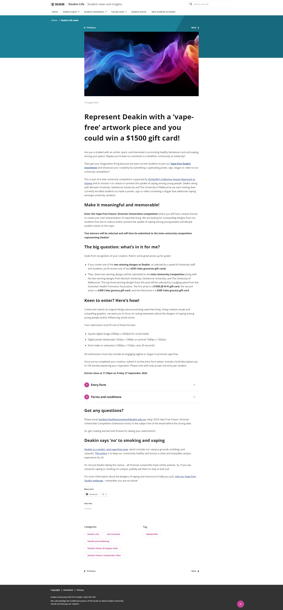

# Task 2 - Process documentation:

## Scope:

### Assessing Potential Projects: A Three-Tiered Framework:

To effectively evaluate potential projects, the following key aspects will be considered as a framework when deciding the chosen project:

1. **Impact:** The project's ability to evoke strong emotional responses or sentimental connections.
2. **Relevance:** The project's significance in being able to measure data (environmental or sensor data).
3. **Feasibility:** The project's practicality in terms of implementation, considering factors like time, resources, and potential challenges.

For simplicity these metrics will be visualised into a graph, see the example below:


## Research :

### Neopixels:
```04/09/2024```

Approaching this design task I first tried a top-down approach, I decided to investigate an interesting medium. The topic I decided to investigate was a neopixel project. Neopixels were chosen due to their potential to satisfy all aspects of the project scope. The project that was investigated was a volumetric display created by [mitxela.](https://www.youtube.com/@mitxela)


This project utilises an optical illusion called 'persistence of vision', a visual phenomenon where the brain retains an image for a brief period after it's no longer visible. This creates the illusion of motion when a series of still images are displayed quickly enough; similiar to a flip book animation:


Furthermore this illusion can be utilised to make a 2 dimensional plane appear three dimensional, when it is rotated around a fixed point. Mitxela's project implements an electric motor that spins a sheet of neopixels, resulting in the appearance of a three dimensional image:


Evaluating mitxela's [design documentation](https://github.com/mitxela/candle) and [github project](https://github.com/mitxela/candle) it has the potential to be an impactful medium. In its present state however it severly lacks in  depth as there is nothing meaningful; it is simply visually appealing. Not to descredit mitxela's design, it just doesn't suit the needs of this project.

Therefore, if the project were implemented it would have to further developed to convey meaning, using some form of meaningful data. Weather or temperature data from a web api or sound data from its surroundings would be appriopriote but further decrease the feasibility of the project. This would increase its impact and relevance as per the design framework.

However, this would impact upon the feasibility would make the project very difficult to complete, as mitxela's design is extremely intricate. Overall it rates in the framework as follows:


### Python Mental Health App:
```13/09/2024```
Inspired by the complexity of my previous project, I adopted a bottom-up approach, starting with an idea and then exploring its feasibility. My longstanding interest in mental health led me to envision some form of mindfulness app as a meaningful and rewarding design challenge. I chose Python as the development language for this project.

Having recently used Python in my database design class, I found it a familiar and accessible choice for this project. Python's compatibility with most iOS devices and my existing skills in GUI development using Tkinter and Unity made it a practical option. To outline my ideas, I've arranged them from simplest to most complex implementation:
1. A mindfulness diary - an application that implements a virtual garden that you attend to by writing entries to make plants grow
2. A mindfulness engagement app - an application that utilises an [AI-Powered Meditation Generator API](https://buildship.com/blog/building-an-ai-powered-meditation-generator-api-with-buildship) to create tailored meditations for people suffering from anxiety and depression.
3. A mindfulness game - a relaxing/medatative gardening game utilising the [Unity](https://unity.com/) game engine and [Meteo Matics](https://www.meteomatics.com/en/weather-api/?ppc_keyword=weather%20api&utm_term=weather%20api&utm_campaign=Weather+API+(Australien)&utm_source=adwords&utm_medium=ppc&hsa_acc=5001518620&hsa_cam=16948893264&hsa_grp=138721398634&hsa_ad=593648296523&hsa_src=g&hsa_tgt=kwd-40383213246&hsa_kw=weather%20api&hsa_mt=e&hsa_net=adwords&hsa_ver=3&gad_source=1&gclid=Cj0KCQjwjY64BhCaARIsAIfc7YZDPhvVvZ04Wci_YFs6cRl38MSfkDfMMZPiaHskBMFPXC29pRQh5BAaApfDEALw_wcB#availabledata) web api to engage the player in real world weather data, reflected in the virtual space.

#### Further Analysis:
After evaluating my ideas, I determined that the first two projects align with my capabilities and the scope of this endeavor. However, the third concept exceeds my current comfort level, as I haven't undertaken such a large project independently. Therefore, I will concentrate on researching existing mindfulness apps to gain insights for my chosen approach

The first application I investigated was the [headspace](https://www.headspace.com/headspace-meditation-app) app, which resembles what imagine project two would look like. It is very UI heavy, which does make it less appealing, however given my ability and the nature of the idea I don't know how else I could implement it:


```Source:``` [How to use the head space app](https://youtu.be/IYTPmUDnYog)

Given the sensitive nature of mental health, I am hesitant to rely solely on AI learning models for providing support to individuals struggling with these issues. The potential for AI to misinterpret or exacerbate mental health concerns undermines the very purpose of the project. For these reasons I decided to focus on my first idea.

This left my initial idea of a mindfulness diary, which aligns with the project scope, however it lacks originality. A quick online search revealed several existing apps that offer similar functionalities. Therefore, I've decided to explore alternative concepts:

Similiar apps I found include:
- [Kinder World: Wellbeing Plants](https://apps.apple.com/us/app/kinder-world-wellbeing-plants/id1541796687)
- [Forest App](https://www.forestapp.cc/)
- [Plant Nanny](https://play.google.com/store/apps/details?id=com.fourdesire.plantnanny2&hl=en_AU)
- [Smiling Mind](https://www.smilingmind.com.au/)

This culminated in the following metrics for the idea overall:


### Anti-vaping Art Piece:
```26/09/2024```
As I continue to brainstorm design project ideas, I'm drawn to the potential impact of addressing mental health issues. My personal struggle with nicotine addiction, which has persisted for a year, has made me acutely aware of its detrimental effects on both mental and physical well-being. To better understand how I can show the hold that vaping has on me, I've decided to research other art pieces.

I ended up finding some art competitions that occured that called on designers to provide art pieces that highlight how you can quit vaping:

```Source:```[Know the truth art challenge](https://knowthetruth.everfi.com/)


```Source:```[Deakin University Art Competition](https://blogs.deakin.edu.au/deakinlife/2024/08/19/represent-deakin-with-a-vape-free-artwork-piece-and-you-could-win-a-1500-gift-card/)

Discovering these competitions solidified my determination to create a meaningful artwork that addresses this pressing issue. It has also motivated me to openly acknowledge my struggles with quitting

Reviewing the 2023 Know the Truth competition entries, I was particularly struck by the confrontational nature of many pieces. One of my biggest challenges in quitting has been justifying my decision. The winning artwork resonated with me, featuring powerful messages about self-justification and peer pressure:


```Source:```[Know the truth art challenge winner, Kayla](https://knowthetruth.everfi.com/)

I believe I've discovered a project idea that fully meets the outlined requirements in a balanced and impactful way. The next step is to determine how I'll integrate visual design and user input into my artwork, the metrics for this design are as follows:


## Project Development:
```30/09/2024```
"While considering implementation, I've developed a metaphor that embodies the essence of my artwork: 'You Can't Fill a Bottomless Cup.' This concept, likely rooted in psychology or philosophy, perfectly encapsulates the project's central theme.

But how can I convey this message, in a way that is confronting enough that it might break the cycle of someone struggling with quitting nicotine. My first idea is to confront the viewer with a 3d print of a person laying down struggling to breathe, for now I will go off of this AI generated image from [openart.ai:](https://openart.ai/)


```Source:```[Openart.ai](https://openart.ai/)

 To convey the constant need for nicotine, I've conceived a scale-based measurement system. A 3D-printed or styrofoam figure will represent a person, and the presence of objects placed atop it will symbolise the overwhelming demands of addiction.

 When a vape is placed on the scale, it sends a signal to a microcontroller, silencing an alarm. However, if the scale remains empty for too long, the alarm intensifies, signifying the urgent need for nicotine. I would also like to include vibrating motor to make the figure appear as if they are shaking, this will intesify the experience.

 The following is a sketch that outlines my idea:
 

To implement this project, I've chosen Arduino due to its extensive documentation and use of C++, a language I'm eager to learn. The following components will be required:
 - Arduino Uno R4- available from Jaycar and online, found [here.](https://www.jaycar.com.au/arduino-uno-wifi-r4-development-board/p/XC9211)
 - 5V Vibrating Motor Module High and Low Motor, found online [here.](https://www.ebay.com.au/itm/186702135398?chn=ps&_ul=AU&norover=1&mkevt=1&mkrid=705-139619-5960-0&mkcid=2&mkscid=101&itemid=186702135398&targetid=2365752142950&device=c&mktype=pla&googleloc=9069073&poi=&campaignid=21766134162&mkgroupid=175112620264&rlsatarget=pla-2365752142950&abcId=10047381&merchantid=548724996&gad_source=1&gclid=Cj0KCQjwjY64BhCaARIsAIfc7YYG3_iWqa_lR8u_kZI4VlCUy5M0lEJPnqfWoHeoOwjbRl2pYflCEg8aApJrEALw_wcB)
 - Arduino Compatible Audio Amplifier with Speaker Module from Jaycar and online, found [here](https://www.jaycar.com.au/arduino-compatible-audio-amplifier-with-speaker-module/p/XC3744?srsltid=AfmBOoojRRIyjeCMKvb30vUI1rToZAg6h0-e9mk6PV5BJHd6m7xPXHN8)
 - 50KG Load Cell Weight Sensor Module, found online [here.](https://www.auselectronicsdirect.com.au/50kg-load-cell-weight-sensor-module-for-electronic?gad_source=1&gclid=Cj0KCQjwjY64BhCaARIsAIfc7YbxmDoyz-uU4ZQ2vEQBXmniLStkWcy8S3dsi9PVh2wLAc7sdZi-6KgaAqscEALw_wcB)
 - A metal plate to distrbute the load on the load cell.
 - Either styrofoam or a 3d stl file to represent the body.

## Design Documentation Moving Forward:
```02/10/2024```

1. Hardware Setup and Testing:

Assemble the hardware components, including the Arduino, motor, amplifier, load cell, and figure.
Test the individual components to ensure they are functioning correctly.
Connect the components to the Arduino and verify their communication.

2. Arduino Programming:

Write the Arduino code to control the scale, alarm, and vibrating motor.
Implement the following logic:
 1. When a vape is placed on the scale, the alarm is silenced.
 2. If the scale remains empty for a predetermined time, the alarm intensifies.
 3. The vibrating motor activates to simulate withdrawal symptoms.
 4. Consider using libraries like tone() for sound generation and Servo for controlling the vibrating motor.

 4. Integration and Testing:

Combine the hardware and software components to create a fully functional prototype. Thoroughly test the system to ensure it operates as intended and meets the project goals. Make necessary adjustments to the code or hardware if issues arise.

5. Refinement and Presentation:

Refine the design and aesthetics of the art piece to enhance its impact and visual appeal. Prepare the final presentation of the project, including a demonstration of its functionality and a discussion of the underlying message.

## Final Considerations:
```03/10/2024```
- Power Supply: Ensure that the Arduino and other components have a reliable power source.
- Sensor Sensitivity: Adjust the sensitivity of the load cell to accurately detect the weight of a vape.
- Alarm Intensity: Experiment with different alarm sounds and intensities to create a powerful and impactful experience.
- User Interaction: Consider adding elements of user interaction, such as a button to reset the alarm or a display to provide feedback.
- Ethical Considerations: Be mindful of the potential impact of the art piece on viewers, especially those struggling with addiction  or mental health issues.